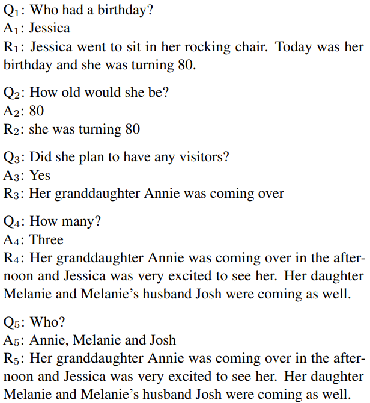

# QuestionAnswering

Question Answering is a type of natural language processing task that involves understanding a question posed in natural language and providing a relevant answer. 
It requires machines to understand the context and intent of the question, extract relevant information from the given source, and formulate an appropriate response.
 
### Collaborators
*  Iulian Zorila
*  Davide Brescia
*  Daniele Marini

## Dataset
We have used in this project the <a href="https://arxiv.org/pdf/1808.07042.pdf">CoQa (Conversational Question Answering) dataset</a> which poses various challenges,
for instance, coreference and pragmatic reasoning, that is, the model should be able to answer questions related to previous ones 
(which will be referred to as _history_), therefore must have the capacity to contestualize.

**Conversation example**:

## Models
We levereged on the HuggingFace library to use Transformers, composing an Encoder-Decoder architecture. In particular we employed:
*  <a href="https://huggingface.co/prajjwal1/bert-tiny">Bert-tiny</a>
*  <a href="https://huggingface.co/distilroberta-base">DistilRoBERTa base</a>

After loading the pretrained models, they were fine-tuned for 3 epochs using the Colab GPU. Bert-tiny required around 30 minutes, while DistilRoBERTa being
significantly heavier in terms of paramaters (Encoder: 82,118,400 | Decoder: 96,353,625 vs Bert-tiny Encoder: 4,385,920 | Decoder: 4,549,306), takes more than
2 hours.

## Evaluation
The models were evaluated using the 
<a href="https://github.com/allenai/allennlp-models/blob/b1f372248c17ad12684d344955fbcd98e957e77e/allennlp_models/rc/tools/squad.py">SQUAD-F1 metric</a>:
*  Bert-tiny reached:
    * Without history: 0.1843 Test set - 0.1823 Validation set
    * With history: &emsp;&nbsp;    **0.1915** Test set - 0.1848 Validation set
*  DistilRoBERTa base reached:
    * Without history: 0.4596 Test set - 0.4472 Validation set
    * With history: &emsp;&nbsp;    **0.5105** Test set - 0.4918 Validation set

Whereby history includes the last 3 conversations (i.e. 3 question/answer pairs).

## Conclusions
Despite the models being inadequate for Seq2Seq generation, as they are designed to work better as encoders, rather than decoders, we still obtained acceptable results with DistilRoBERTa, although we fine-tuned only for 3 epochs.
